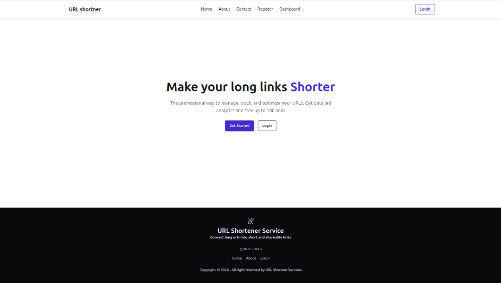
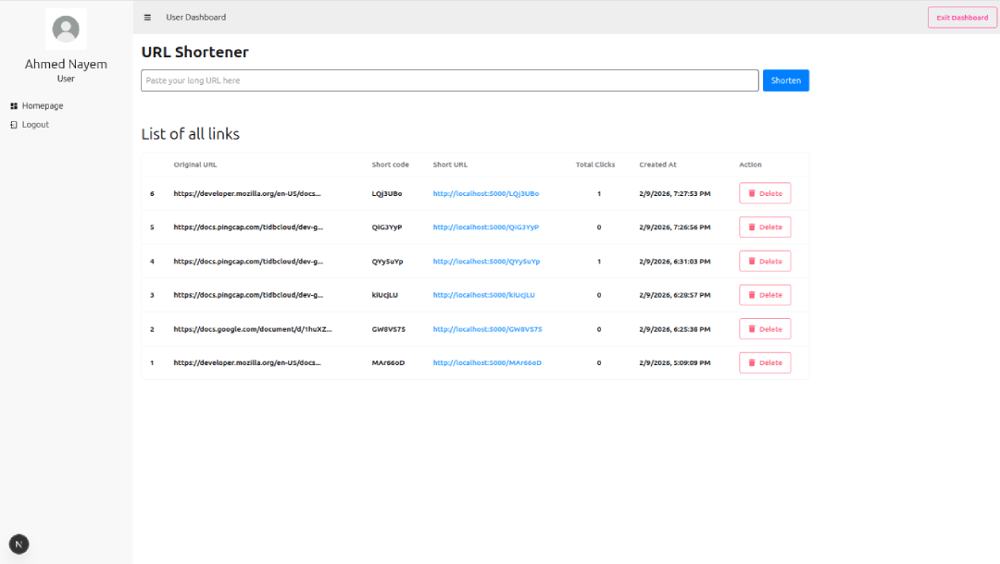

# URL Shortener Service

A full-stack URL shortener application that allows authenticated users to create, manage, and track shortened URLs via a dashboard.

## live link
[URL Shortner](https://url-shortener-servicez.vercel.app)

## Screenshots



## Project Structure
This is a monorepo-style setup containing both the frontend and backend:

- **/frontend**: Next.js (React) application using Tailwind CSS.
- **/backend**: Express API using TypeScript and MySQL.

## Tech Stack
- Frontend: Next.js (App Router), Tailwind CSS, Daisy UI
- Backend: TypeScript, Node.js, Express
- Database: MySQL (Relational)
- Auth: JWT (JSON Web Tokens) & Bcrypt (Password Hashing)

##  Design Decisions & Notes
- Component-Based Architecture: UI elements are modular for easier maintenance and testing.
- Full Short URL Display: Generates complete URLs in the dashboard using the backend short codes.
- Delete Functionality: Users can safely remove links with confirmation dialogs using SweetAlert2.
- Notifications: Toast notifications for success, errors, and warnings.
- Responsive Layout: Tailwind utility-first approach ensures dashboard usability across devices.
- JWT + HttpOnly Cookies: Secures authentication and prevents XSS attacks.
- Click Tracking: Every redirect increments the click counter for analytics.
- Delete Endpoint: Users can remove their links safely with confirmation dialogs on the frontend.

## Recent Modification
- Redefined frontend codebase to utilize Next Js SSR
- Moved setting up httpOnly cookie to next js server, which fixed cookie related issue due to different hosting platform used for frontend and backend

## This project is hosted on
- frontend : vercel
- backend : render
- server awaken by UptimeRobot

## Getting Started
To run this project locally, follow these steps in order:

### 1. Database Setup
- Ensure you have a MySQL server running.
- Create a database named `url_shortener`.
- The table schemas are located in `/backend/src/config/schema.sql`.
- For localhost testing, use config/db.ts in server code

### 2. Backend Setup
```bash
cd backend
npm install
# Copy .env.example to .env and fill with your credentials
npm run dev
```

### 3. Frontend Setup
```bash
cd frontend
npm install
# Copy .env.example to .env.local and paste backend api link
npm run dev
```

## Timeline
**Created:** January 6, 2026  
**Last Updated:** February 10, 2026  

Feel free to provide any feedback, thanks